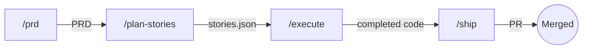

# Claude God-Mode

**Production-grade engineering workflow for Claude Code. Ship features, not prompts.**

- **End-to-end pipeline** -- go from idea to merged PR with `/prd`, `/plan-stories`, `/execute`, `/ship`
- **Quality gates enforcement** -- typecheck, lint, test, and security checks run automatically before anything ships
- **Isolated worktrees** -- agents write code in separate git worktrees so your main branch stays clean
- **Language-agnostic** -- auto-detects your toolchain (package manager, test runner, linter, formatter, build system)

## Pipeline



**1. `/prd` -- Define the feature.** You describe what you want to build and `/prd` generates a Product Requirements Document covering goals, requirements, and scope. The PRD becomes the single source of truth for everything downstream. *On failure: edit the PRD directly and re-run.*

**2. `/plan-stories` -- Break it into stories.** Reads the PRD and produces a `stories.json` file with prioritized, dependency-ordered user stories. Each story has acceptance criteria and quality gate commands tailored to your project's toolchain. *On failure: edit stories.json manually or re-run with refinements.*

**3. `/execute` -- Build it.** Spawns `@executor` agents that implement stories in isolated git worktrees, optionally running multiple stories in parallel. After each story, `@reviewer` performs a code review and `@security-auditor` checks for vulnerabilities. Stories that fail review are reworked automatically. *On failure: re-run `/execute` -- it picks up from the first incomplete story.*

**4. `/ship` -- Ship it.** Runs all quality gates (typecheck, lint, test, build), consolidates commits, and opens a pull request. Nothing ships unless every gate passes. *On failure: fix the failing gate and re-run `/ship`.*

## Quick Start

### Option A: Plugin Marketplace (Recommended)

```bash
# Add the marketplace registry
claude plugin marketplace add SyloRei/claude-marketplace

# Install the plugin
claude plugin install claude-godmode@sylorei-plugins
```

After installing, enable the statusline by running `/godmode statusline` in Claude Code.

### Option B: Manual Install

```bash
git clone https://github.com/sylorei/claude-godmode.git
cd claude-godmode
./install.sh
```

The install script backs up your existing `~/.claude/` config (timestamped), copies agents, skills, hooks, CLAUDE.md, and INSTRUCTIONS.md, and merges settings.json additively -- your existing permissions and plugins are preserved.

### Uninstall

```bash
./uninstall.sh
```

Restores from the most recent backup created during install.

## Which Workflow?

| Task | Workflow | What Happens |
|------|----------|--------------|
| New feature (complex) | `/prd` then `/plan-stories` then `/execute` then `/ship` | Full pipeline: PRD, stories, parallel execution, review, PR |
| New feature (simple) | `/tdd` or `@writer` then `/ship` | Write code directly with TDD or an isolated agent, then ship |
| Bug fix | `/debug` then `/ship` | Reproduce, hypothesize, isolate, fix, verify, then ship |
| Refactor | `/refactor` then `/ship` | Safe restructuring with test verification at every step |
| Add tests (new feature) | `/tdd` | Red-green-refactor cycle drives the implementation |
| Add tests (existing code) | `@test-writer` | Generates tests for code that already exists |
| Explore / understand | `/explore-repo` or `@researcher` | Deep codebase analysis or web research without modifying code |
| Ship / create PR | `/ship` | Runs quality gates, cleans up git, creates PR |

> **Tip:** When in doubt, start with `/prd`. It only takes a minute, and you can always skip `/plan-stories` if the scope turns out to be small.

## Individual Workflows

### /debug

**When to use:** You have a bug to fix -- something is broken, failing, or behaving unexpectedly.

**Steps:**

1. **Reproduce** -- get the exact error and confirm the bug exists
2. **Hypothesize** -- form 2-3 hypotheses based on evidence
3. **Isolate** -- test hypotheses one at a time to narrow to the root cause
4. **Fix** -- apply a minimal targeted fix and write a regression test
5. **Verify** -- run quality gates to confirm the fix and no regressions

Follow up with `/ship` when ready. All work happens in your current branch.

### /refactor

**When to use:** Code works but needs restructuring -- extracting functions, renaming, reorganizing modules.

**Steps:**

1. **Test before** -- run the full test suite and confirm everything passes
2. **Refactor** -- make one structural change at a time, committing after each step
3. **Test after** -- run the test suite again after every change
4. **Revert on failure** -- if tests break, revert the last step and try a smaller change

Never mix refactoring with new features in the same commit. Follow up with `/ship` when done.

### /tdd

**When to use:** Building new behavior where tests should drive the design.

**Steps:**

1. **Red** -- write a failing test that describes the desired behavior
2. **Green** -- write the minimum code to make the test pass
3. **Refactor** -- clean up the implementation while keeping tests green
4. Repeat until the feature is complete

**`/tdd` vs `@test-writer`:** Use `/tdd` when building something new -- the tests come first and shape the code. Use `@test-writer` when adding tests to code that already exists.

## When Things Go Wrong

| Situation | What to Use |
|-----------|-------------|
| Bug found before shipping | [`/debug`](#debug) to isolate and fix, then `/ship` |
| Bug found after merge | [`/debug`](#debug) on a new branch, then `/ship` to PR the fix |
| Flaky or missing tests | [`/tdd`](#tdd) for new coverage, `@test-writer` for existing code |
| Messy code that works | [`/refactor`](#refactor) -- tests must pass before and after every step |
| Security concern | `@security-auditor` for audit, then fix findings manually or with `@writer` |
| Architecture question | `@architect` for design advice (advisory, read-only) |
| Missing documentation | `@doc-writer` to generate docs from existing code |

## Agents

| Agent | Model | Purpose |
|-------|-------|---------|
| `@writer` | opus | Implementation in isolated worktree |
| `@executor` | opus | Story execution from stories.json |
| `@reviewer` | opus | Code review (read-only) |
| `@researcher` | sonnet | Codebase and web research |
| `@architect` | opus | System design (advisory) |
| `@security-auditor` | opus | Security audit (read-only) |
| `@test-writer` | opus | Test generation in isolated worktree |
| `@doc-writer` | sonnet | Documentation |

## Skills

| Skill | Purpose |
|-------|---------|
| `/prd` | Generate Product Requirements Document |
| `/plan-stories` | Convert PRD to executable stories.json |
| `/execute` | Run executor + reviewer agents on stories |
| `/ship` | Quality gates, git cleanup, PR creation |
| `/debug` | Structured debugging protocol |
| `/tdd` | Test-driven development (red-green-refactor) |
| `/refactor` | Safe refactoring with test verification |
| `/explore-repo` | Deep codebase exploration |

## Hooks

| Hook | Trigger | Purpose |
|------|---------|---------|
| **SessionStart** | Conversation begins | Injects project context (language, package manager, test runner, git state) |
| **PostCompact** | After `/compact` | Restores quality gates and available skills after context compaction |
| **StatusLine** | Continuous | Shows context %, model, cost, project, branch (run `/godmode statusline` to enable) |

## How It Works

Claude God-Mode is a Claude Code plugin defined by `plugin.json`. It installs **agents** (specialized Claude instances with dedicated system prompts and model assignments), **skills** (slash-command workflows composed of multiple steps), and **hooks** (shell scripts that fire on session events). The global `CLAUDE.md` provides coding standards, quality gates, and routing logic that all agents inherit. `INSTRUCTIONS.md` supplies detailed behavioral conventions. Together, these files transform Claude Code from a general assistant into a structured engineering team.

## Customization

After installing, customize to match your workflow:

1. **`~/.claude/CLAUDE.md`** -- Edit the `Identity` and `Response Style` sections to match your preferences
2. **`~/.claude/INSTRUCTIONS.md`** -- Adjust agent behaviors and conventions
3. **`~/.claude/settings.json`** -- Add/remove permissions for your toolchain

## Updating

### Plugin

```bash
claude plugin marketplace add SyloRei/claude-marketplace
claude plugin install claude-godmode@sylorei-plugins
```

### Manual

```bash
cd claude-godmode
git pull
./install.sh   # creates a new backup before overwriting
```

## Requirements

- [Claude Code](https://docs.anthropic.com/en/docs/claude-code) CLI installed
- `jq` (for install script settings merge): `brew install jq`

## FAQ

### Does this work with Sonnet/Haiku?

Agents specify their target models in their configuration, but you can edit any agent file to use a different model. Research-oriented agents (`@researcher`, `@doc-writer`) already default to Sonnet.

### Will this overwrite my config?

No. The install script creates a timestamped backup of your `~/.claude/` directory before making any changes, and merges `settings.json` additively -- your existing permissions and plugins are preserved.

### Can I use individual parts?

Yes. You can cherry-pick individual agents, skills, or hooks. Copy just the files you want into your `~/.claude/` directory. Each component is self-contained.

### What languages does this support?

Claude God-Mode is language-agnostic. The SessionStart hook auto-detects your project's toolchain (package manager, test runner, linter, formatter, build system) and injects that context into every conversation.

## Contributing

See [CONTRIBUTING.md](CONTRIBUTING.md) for guidelines on adding agents, skills, hooks, and submitting pull requests.

## License

[MIT](LICENSE)
